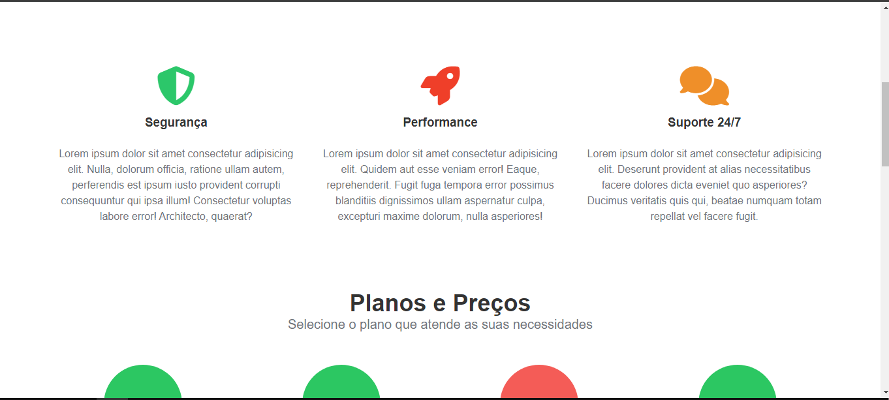
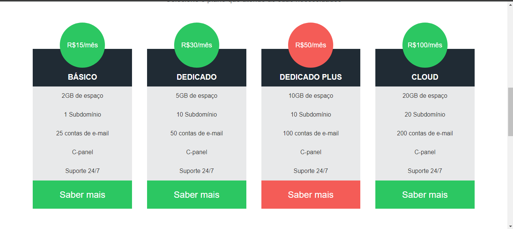
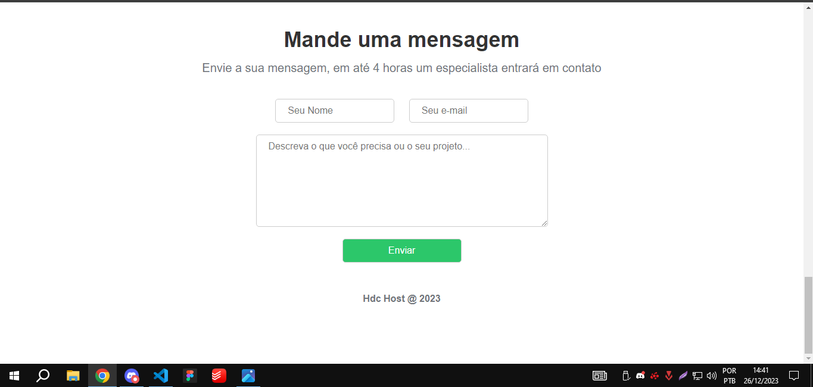

<h2>Landig Page HDC Host - Praticando com HTML e CSS</h2>

Ei, tudo bem? Esse projeto foi passado pelo professor no curso da Udemy, utilizei somente html e css

Também pratiquei minha responsividade, o website está responsivo em: Celulares, Laptops, Desktop e Celular

Tive um pouco de dificuldade na responsividade, mas com a pratica consigo aprender de boas kkk.

<h2>Imagens do Produto:</h2>

<h2>Espero que curtem, até o próximo projeto!!</h2>
